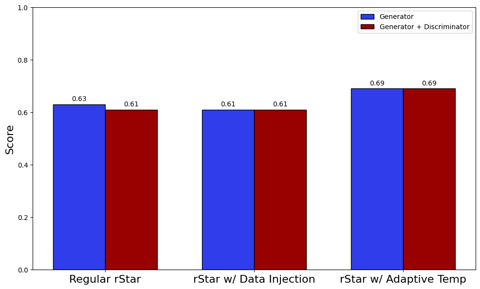

# rStar w/ adaptive temperature

This repository contains necessary scripts to run **rStar**'s generator and discriminator along with another sampling mechanism based on adaptive temperature.

> Link to original paper: https://huggingface.co/papers/2408.06195, https://arxiv.org/abs/2408.06195
> 
> Link to adaptive temperature paper: https://arxiv.org/abs/2410.01104

## Job script

The script used to run this on a HPC cluster is found in ```job_script.sh```.

## Results

We were unable to reproduce the results from the rStar paper when the discriminator is added but we can see a significant boost in accuracy from using adaptive temperature as sampling mechanism
<p align="center">
  
</p>


